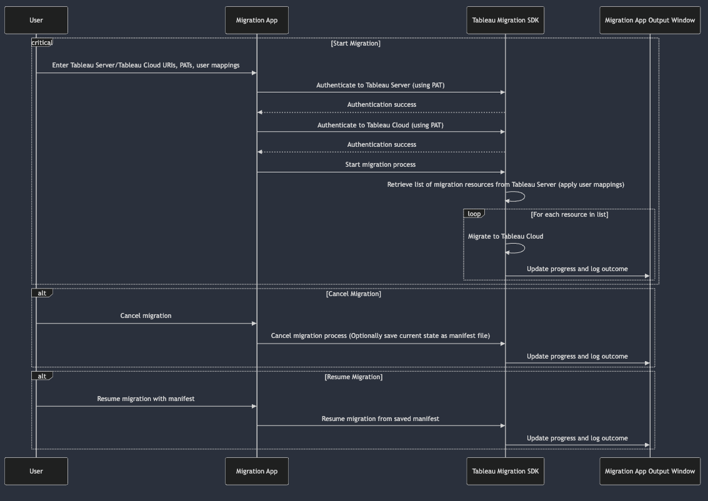

# Contributing Guide For Tableau MIgration App

This page lists the operational governance model of this project, as well as the recommendations and requirements for how to best contribute to Tableau Migration App. We strive to obey these as best as possible. As always, thanks for contributing � we hope these guidelines make it easier and shed some light on our approach and processes.

# Governance Model
## Salesforce Sponsored

The intent and goal of open sourcing this project is to increase the contributor and user base. However, only Salesforce employees will be given `admin` rights and will be the final arbitrars of what contributions are accepted or not.

# Getting started

Please join the community here: [Tableau Developer Community](https://tabsoft.co/JoinTableauDev)

# Tableau Migration App to SDK Sequence Diagram

# Issues, requests & ideas

Use GitHub Issues page to submit issues, enhancement requests and discuss ideas.

### Bug Reports and Fixes
-  If you find a bug, please search for it in the [Issues](https://github.com/tableau/tableau-migration-app/issues), and if it isn't already tracked,
   [create a new issue](https://github.com/tableau/tableau-migration-app/issues/new). Fill out the "Bug Report" section of the issue template. Even if an Issue is closed, feel free to comment and add details, it will still
   be reviewed.
-  Issues that have already been identified as a bug (note: able to reproduce) will be labelled `bug`.
-  If you'd like to submit a fix for a bug, [send a Pull Request](#creating_a_pull_request) and mention the Issue number.
  -  Include tests that isolate the bug and verifies that it was fixed.

### New Features
-  If you'd like to add new functionality to this project, describe the problem you want to solve in a [new Issue](https://github.com/tableau/tableau-migration-app/issues/new).
-  Issues that have been identified as a feature request will be labelled `enhancement`.
-  If you'd like to implement the new feature, please wait for feedback from the project
   maintainers before spending too much time writing the code. In some cases, `enhancement`s may
   not align well with the project objectives at the time.

### Tests, Documentation, Miscellaneous
-  If you'd like to improve the tests, you want to make the documentation clearer, you have an
   alternative implementation of something that may have advantages over the way its currently
   done, or you have any other change, we would be happy to hear about it!
  -  If its a trivial change, go ahead and [send a Pull Request](#creating_a_pull_request) with the changes you have in mind.
  -  If not, [open an Issue](https://github.com/tableau/tableau-migration-app/issues/new) to discuss the idea first.

If you're new to our project and looking for some way to make your first contribution, look for
Issues labelled `good first contribution`.

# Contribution Checklist

- [x] Clean, simple, well styled code
- [x] Commits should be atomic and messages must be descriptive. Related issues should be mentioned by Issue number.
- [x] Comments
  - Module-level & function-level comments.
  - Comments on complex blocks of code or algorithms (include references to sources).
- [x] Tests
  - The test suite, if provided, must be complete and pass
  - Increase code coverage, not versa.
  - Use any of our testkits that contains a bunch of testing facilities you would need. For example: `import com.salesforce.op.test._` and borrow inspiration from existing tests.
- [x] Dependencies
  - Minimize number of dependencies.
  - Prefer Apache 2.0, BSD3, MIT, ISC and MPL licenses.
- [x] Reviews
  - Changes must be approved via peer code review

# Creating a Pull Request

1. **Ensure the bug/feature was not already reported** by searching on GitHub under Issues.  If none exists, create a new issue so that other contributors can keep track of what you are trying to add/fix and offer suggestions (or let you know if there is already an effort in progress).
3. **Clone** the forked repo to your machine.
4. **Create** a new branch to contain your work (e.g. `git br fix-issue-11`)
4. **Commit** changes to your own branch.
5. **Push** your work back up to your fork. (e.g. `git push fix-issue-11`)
6. **Submit** a Pull Request against the `main` branch and refer to the issue(s) you are fixing. Try not to pollute your pull request with unintended changes. Keep it simple and small.
7. **Sign** the Salesforce CLA (you will be prompted to do so when submitting the Pull Request)

> **NOTE**: Be sure to [sync your fork](https://help.github.com/articles/syncing-a-fork/) before making a pull request.

# Code of Conduct
Please follow our [Code of Conduct](CODE_OF_CONDUCT.md).

# License
By contributing your code, you agree to license your contribution under the terms of our project [LICENSE](LICENSE.txt) and to sign the [Salesforce CLA](https://cla.salesforce.com/sign-cla)